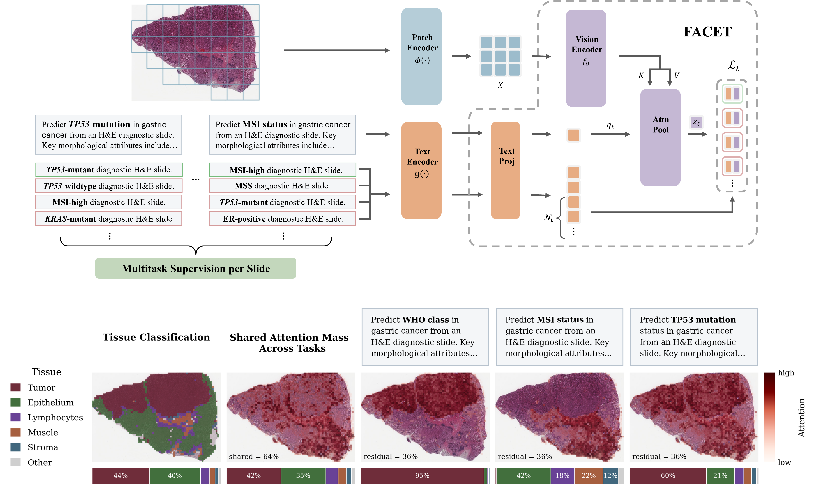

# FACET

## Rethinking Whole-Slide Foundation Models Through Task-Conditioned Views

> **Anonymous submission to ICLR 2027, under review. Model weights will be released upon publication.**


<details><summary><h3>Abstract</h3></summary>

Foundation models (FMs) have demonstrated great success in computational pathology, first at the
patch level and more recently at the whole-slide level. Despite being trained on increasingly large
WSI corpora and, in some cases, incorporating additional molecular or textual modalities, existing
slide-level FMs generally produce a single representation per slide, agnostic to the downstream
task. This design is inherently limiting: a whole-slide image contains diverse morphological
signals, only a subset of which may be relevant for any given clinical or biological question. We
propose FACET, a whole-slide foundation model that conditions slide representations on task
descriptions, enabling dynamic inference-time aggregation tailored to each prediction objective.
FACET is pretrained through supervised multitask learning across 29 carefully curated prediction
tasks spanning six cancer types, aligning task-conditioned slide representations with text-derived
class prototypes. We evaluate FACET on an external benchmark comprising 40 distinct tasks,
including tasks and cancer types not observed during pretraining. FACET achieves state-of-the-art
performance against leading slide-level foundation models and maintains high performance on both
unseen tasks and unseen cancer types, demonstrating robust generalization.

</details>



## Why FACET?

Slide-level foundation models compress a whole-slide image into one embedding and reuse it for
every downstream question. A slide, though, carries many kinds of morphological evidence, and only
some of it bears on any given clinical or biological task.

FACET drops the assumption that one embedding fits all. It reads a natural-language description of
the prediction objective and uses it as the query of a cross-attention pooling layer over the
slide's patch tokens, so the same slide yields a different representation `z_t` for every task,
each weighted toward the evidence that task needs. On an external benchmark of 40 CPTAC tasks,
FACET outperforms leading slide-level foundation models, including on prediction objectives and
cancer types it never saw during pretraining.

- **New tasks cost a sentence, not a training run.** Describe the objective and query the model.
  No per-task head, no labels, no finetuning.
- **Clinical context is just more text.** Appending a patient attribute to the task description
  folds priors beyond morphology into the representation, with the model untouched.
- **Small and reproducible.** 3.1M parameters pretrained on 3,359 public TCGA slides, an order of
  magnitude less pretraining data than most slide-level foundation models.
- **Everything but the weights is here.** All 69 task definitions, label files, splits and
  descriptions used in the paper.


## Installation

```bash
git clone <this repository> && cd FACET
conda create -n facet python=3.10 -y && conda activate facet
pip install --upgrade pip
pip install -e .
pip install git+https://github.com/Mahmoodlab/CONCH.git   # text encoder
```

Downstream evaluation uses [Patho-Bench](https://github.com/mahmoodlab/Patho-Bench), which is not a
dependency of the `facet` package and is installed on its own:

```bash
git clone https://github.com/mahmoodlab/Patho-Bench.git && cd Patho-Bench
pip install -r requirements.txt && pip install -e .
```

This also brings in [TRIDENT](https://github.com/mahmoodlab/trident), which we used to preprocess
whole-slide images into patch features.

## Model access

This is an anonymized repository accompanying an ICLR submission under review. **FACET weights are
not included.** They will be released on Hugging Face upon publication.

FACET builds on two gated Mahmood Lab models and redistributes neither. Request access
individually to [CONCH v1.5](https://huggingface.co/MahmoodLab/conchv1_5) (patch features) and
[CONCH](https://huggingface.co/MahmoodLab/conch) (text encoder), then run `huggingface-cli login`.

## Usage

### 1. Patch features

FACET consumes **CONCH v1.5 patch features** in TRIDENT's output format: one `.h5` per slide
holding a `features` dataset of shape (N, 768) and the matching level-0 `coords`. The paper uses
20x, 512 px patches without overlap.

### 2. Task description

A task reaches FACET as a `task_desc.json`:

```json
{
  "task": "Predict KRAS mutation status in colon adenocarcinoma. Classes: wildtype vs. mutant. On H&E, relevant clues include conventional gland-forming morphology, dirty necrosis, mucin production, infiltrative growth, and variation in tumor differentiation that may separate KRAS-mutant from wildtype tumors.",
  "classes": {
    "0": "KRAS wildtype colon adenocarcinoma with less distinctive KRAS-associated mucinous or infiltrative morphology.",
    "1": "KRAS mutant colon adenocarcinoma showing conventional glandular growth, often with mucin production, dirty necrosis, and infiltrative architecture."
  }
}
```

Inference reads only the `"task"` field. The per-class text was the supervision signal during
pretraining and is released for completeness.

All 69 descriptions used in the paper are already here, under
[data/pretraining](data/pretraining) and [data/evaluation](data/evaluation). A **new task** needs a
Patho-Bench style `config.yaml` stating the objective and its `label_dict`, and a description
generated from the paper's fixed prompt. Which LLM answers the prompt is your choice; we used
GPT-5.4 at temperature 0.

**With a chat interface.** Build the prompt and paste it into any chat model:

```bash
python scripts/generate_descriptions.py prompt my_tasks/cohort/my_task --out prompt.txt
```

`prompt.txt` is the complete prompt. The model returns a JSON array; save the object for your
task as `task_desc.json` in the task folder.

**With an LLM API.** For more tasks than you want to paste by hand, `generate_descriptions` sends
the same prompt in small batches through a callable you provide, and writes a `task_desc.json` into
every folder:

```python
from facet.text import generate_descriptions

generate_descriptions(task_dirs, llm=my_api_call, batch_size=5)
```

`my_api_call` is any `(prompt: str) -> str` function wrapping the provider you use, so no vendor
SDK is part of FACET. Answers are checked against each task's classes before anything is written;
see the function's docstring for the details.

Descriptions can also simply be written by hand. Whatever the source, every morphological cue
should be observable on routine H&E.

### 3. Slide embeddings

One slide under one task:

```python
from facet import FACETPipeline

pipe = FACETPipeline.from_pretrained("path/to/facet")
z = pipe.embed_slide("slide.h5", task="data/evaluation/cptac_coad/KRAS_mutation")
z.shape  # torch.Size([256])
```

`task` accepts a task folder, a `task_desc.json` path, a `facet.TaskDescription`, or plain text, so
asking the same slide a different question is a different string. For several slides at once,
`pipe.embed_slides([...], task=...)` pads them into one batch and returns `(B, 256)`.

To embed every slide of one or more tasks and write the files Patho-Bench reads, use the export
CLI, which resolves slides from each task's split file:

```bash
python scripts/extract_embeddings.py \
    --model path/to/facet \
    --tasks-root data/evaluation --tasks cptac_coad/KRAS_mutation \
    --features-dir /path/to/features_conch_v15 \
    --output-dir embeddings/facet
```

Dropping `--tasks` exports all 40 evaluation tasks. Output is
`embeddings/facet/<dataset>/<task>/<slide_id>.h5` (a `features` dataset of shape (1, 256)), plus
one `<case_id>.h5` per case, mean-pooled over the case's slides, for tasks evaluated at case level.
Run with `HF_HUB_OFFLINE=1` and `--text-encoder-checkpoint` to stay offline.

Task-text embeddings can be cached once and reused without the text encoder. Keys are
`<dataset>/<task>`; pass a value as `task_embedding` to `FACET.forward`:

```bash
python scripts/embed_descriptions.py --tasks-root data/evaluation --out task_embeddings.safetensors
```

#### Adding clinical context

Because the query is text, patient-level clinical information enters the representation at
inference time with no retraining: a short sentence describing an attribute is appended to the task
description, giving each patient its own task embedding. This is the mechanism behind the smoking
case study in the paper. No clinical data is released here; the attribute, its phrasing and its
source are yours to choose.

Supply a CSV with a `case_id` column matching the task's split file plus the attribute column, and
a mapping from raw values to sentences. An optional `"Unknown"` key covers missing values; without
it, missing values leave the description unchanged.

```bash
python scripts/extract_embeddings.py \
    --model path/to/facet --tasks-root data/evaluation --tasks cptac_luad/EGFR_mutation \
    --features-dir /path/to/features_conch_v15 --output-dir embeddings/facet_smoking \
    --clinical-csv clinical.csv --clinical-column smoking \
    --clinical-format-map '{"True": "The patient is a smoker.", "False": "The patient is not a smoker."}'
```

### 4. Downstream evaluation

Evaluation uses Patho-Bench as-is on the exported embeddings; this repository ships no evaluation
code. Because FACET embeddings are task-specific, each task is evaluated against its own embedding
directory:

```python
from patho_bench.ExperimentFactory import ExperimentFactory

task_dir = "data/evaluation/cptac_coad/KRAS_mutation"

exp = ExperimentFactory.linprobe(
    split=f"{task_dir}/k=all.tsv",
    task_config=f"{task_dir}/config.yaml",
    pooled_embeddings_dir="embeddings/facet/cptac_coad/KRAS_mutation",
    saveto="results/linprobe/cptac_coad/KRAS_mutation",
    combine_slides_per_patient=True,
    cost=1.0,
    balanced=True,
    num_bootstraps=1000,
)
exp.train()
exp.test()
print(exp.report_results(metric="macro-ovr-auc"))
```

Survival tasks (`task_type: survival`, such as `cptac_luad/OS`) use `ExperimentFactory.coxnet` with
`alpha=0.1` and `l1_ratio=0.1`, reported as `cindex`. KNN in the paper uses `k=15` on L2-normalized
embeddings. All protocols run over the folds stored in each task's `k=all.tsv` with 1000 test-set
bootstraps, and `combine_slides_per_patient=True` throughout, since every `case_id` in the 40
evaluation tasks carries a single label.

## Released data

| Folder | Content |
|---|---|
| [data/pretraining](data/pretraining) | 29 TCGA pretraining tasks over six cohorts: `config.yaml`, `labels.tsv`, `task_desc.json` |
| [data/evaluation](data/evaluation) | 40 CPTAC evaluation tasks over nine cancer types: Patho-Bench `config.yaml` and `k=all.tsv`, our `task_desc.json` |

The evaluation task definitions and splits are the work of the Patho-Bench authors (Mahmood Lab),
redistributed under their license; our addition is the task descriptions. Please cite Patho-Bench
when using them, and see [data/evaluation/README.md](data/evaluation/README.md) for the details.
Whole-slide images are not included; they are available from the GDC (TCGA) and TCIA (CPTAC).

## License and terms of use

FACET and this code are released under
[CC BY-NC-ND 4.0](https://creativecommons.org/licenses/by-nc-nd/4.0/deed.en) and may be used for
non-commercial academic research only, with attribution. Commercial use, sale or other monetization
of FACET or its derivatives is prohibited. The derived label files and task descriptions under
`data/` fall under the same terms. The Patho-Bench splits in `data/evaluation` carry the
Patho-Bench license (CC BY-NC 4.0), and CONCH is subject to its own license and terms of use.

## Reference

Citation details will be added upon publication.

```bibtex
@inproceedings{anonymous2026facet,
  title  = {FACET: Rethinking Whole-Slide Foundation Models Through Task-Conditioned Views},
  author = {Anonymous},
  year   = {2026},
  note   = {Under review}
}
```
